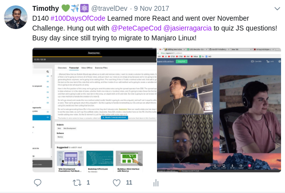
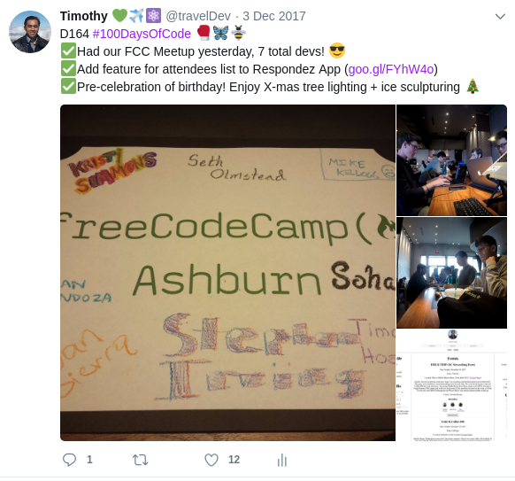
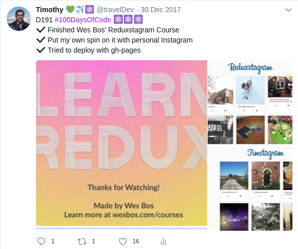
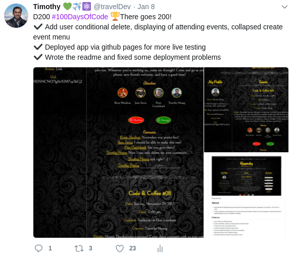

<figure></figure>
<figcaption style=" text-align: center;">Photo by <a href="https://unsplash.com/photos/d-OQYiy1gQo">Paul Morris</a> on <a href="https://unsplash.com/">Unsplash</a></figcaption>

# After 200 days of code
## by Timothy Hoang
### Pharmacist to JavaScript Developer
Tags: #100DaysOfCode, 200 Days of Code, Coding Everyday, Daily Logging

## Introduction
If you want the takeaways, here are 4 points without having to read the whole article. Number 1, React will help improve you JavaScript (Tip: learn basic ES6 before you start React). Number 2, build projects with new technologies and set actionable deadlines for them. Number 3, focus more on the code aspect instead of styling because there might be designers for that. Number 4, give Manjaro Linux a try if you're sick of windows (if you have a Mac, it's already pretty good as is). 

If you're still here, you probably want to read the article. Here we go...after building a ton of momentum from the [first 100 days of code](https://medium.com/@timh1203/100-days-of-code-parallels-with-el-penol-de-guatape-4f92383970cd), I wanted to go for round two. A lot of people want to use R2D2 in their tweet but I just prefer the plain 101 to 200. The second round was quite productive as I built up our Free Code Camp local group, switched to Manjaro Linux from windows for a better dev environment, finished a couple of online courses, and built 3 new projects. This was my first foray into ES6 and React and it has certainly been an awesome ride. What I thought was going to be a brick wall turned out to be a new love for writing React component pieces and connecting them together like a puzzle. It was also a lot easier to deal with when you can just work on one aspect of your app at a time instead of looking at one big file of JavaScript. Here are some significant things that happened on my second round of #100DaysOfCode:

### Days 101 through 125

I started working on the Free Code Camp Wikipedia app at the beginning of this challenge and finished on day 118. To assist with the challenge, I took a free course called [Asynchronous JavaScript Requests](https://www.udacity.com/course/asynchronous-javascript-requests--ud109) from Udacity which helped out a lot! I wanted to get a better handle on AJAX (or more properly, AJAJ), Fetch API, and dealing with promises. On day 109, I also started [Wes Bos's ES6 for Everyone](https://es6.io/) to prime myself for React. This is one of the best courses I have ever owned and still reviewing it after my 200 days of code (there's a lot that came with ES2015/ES6). I do firmly believe that having a good handle on var/let/const variables, scope, spread operator, destructuring, classes, looping with .map/for in/for of, understanding Object.keys/values/entries, and other basic ES6 concepts will help you immensely with React. After all, React is JavaScript at the end of the day and consequently will make your JavaScript better too.

I did started a free [React course on Edx](https://www.edx.org/course/introduction-reactjs-microsoft-dev281x-0) but ended up trashing it since I did not enjoy the pace. There was a lot of copy-pasta code to build a Connect 4 game and I simply didn't learn that way. During this time, I also switched over to [Ubuntu Mate](http://ubuntu-mate.org/) since my Windows 10 had an annoying message to upgrade. It was not too difficult to get use to Linux since the development environment was closer to Mac and I liked it much more than windows actually. Our [Free Code Camp Ashburn](https://free-code-camp-ashburn.github.io/website/) group was just slowly starting up too and I started posting more about our meets, setting up the facebook group, and building our local website.

### Days 126 through 150
This quarter of the leg, I started on the [Free Code Camp Twitch API app](https://timh1203.github.io/twitch-app/). I knew it was going to be more of Fetch API so it was going to be a quick project and I finished on day 130. I started doing [HackerRank](https://www.hackerrank.com/) challenges but evertually stopped since the UI was overcomplicated ([CodeWars](https://www.codewars.com/) is a better platform anyways). My friends and I also attempted to work on a project and do interview prep together but it eventually failed as other things took priority. On day 141, I switched over to [Manjaro Linux](https://manjaro.org/) which was so much better than Ubuntu Mate. Some of the features I loved were Yakuake (a persistent terminal), multiple window switches (try the Desktop Cube Animation, pretty slick), Octopi software manager (watches all your software and informs you of updates), and just the beautiful UI that came with the KDE install. 

Also, I had a job interview for a front-end web developer position on day 145 to build websites with their stack: JavaScript, PHP, and Bootstrap. The company had a couple more rounds of interviews and would let me know in 2 weeks. Unfortunately, I never heard back from them. I proceeded to start [Learn React.js](https://www.lynda.com/React-js-tutorials/Learn-React-js-Basics/519668-2.html), an introductory course on Lynda made in 2016, but it was using old syntax like `React.createClass` (where most people use stateless functional components or ES6 classes). I still pushed through it but it was tough trying to discern between old syntax versus new. If you ever do find yourself working with old React code, [react-codemod](https://github.com/reactjs/react-codemod) is a godsend and helps convert your syntax. It helped me launch the notepad app from that Lynda course actually. 

Afterwards, I started [React.js Essential Training Course](https://www.lynda.com/React-js-tutorials/Learn-React-js-Basics/519668-2.html) on Lynda on day 148. This course was much better but still didn't get into a lot of depth. As a general opinion, Lynda.com courses never go into a lot of explanation or best practices. Some of the courses are hit or miss since they might be older. This was my experience with some of the other courses on there as well. The courses explain some topics well but gloss over the others. The format feels more like watch-me-code and learn. I don't know about you but I learn better if it is explained well and if I code something myself. I shouldn't complain since my library offered the subscription for free (your library might have it too, you should check). They have other cool stuff on there anyways which I hope to check out in the future.

Oh, and I completed all my Pharmacist CE credits too and all 15 long articles with a pass/fail test at the end, but not that it's important to you. Haha

### Days 151 through 175
I started a [photography website](https://timh1203.github.io/photo-site/) for a friend to try out Materialize CSS and an Instagram API. I made a kick-butt contact form for it too. I finished the ReactJS Essential Training course on day 157. 

Then came the intership company in Ohio. I had an online interview and they wanted to see what web app I have completed. Up to this point, I only had the Twitch API app that I built. So I came up with the idea to build a project in React for an event management system that I mentioned during the interview. I strapped down for 1 week and really learned React. It was amazing what I picked up under a time constraint. I built something basic and sent them an email. Unfortunately, I never heard from them. That was okay because I learned a tremendous amount of React anyways and it eventually lead me to try out Firebase too.

We continued our regular Free Code Camp meetups during this period. At one event, we even had record-setting 7 devs turn up. It was also my birthday and Christmas season so there were a lot of different festivities. I got deeper into Firebase and learned a lot about data structure manipulation too.

### Days 176 through 195

At this point, I was stuck on my React app, [Respondez](https://timh1203.github.io/respondez-app/). I didn't quite know how to do deep state manipulation in React (which you should not do by the way). Yet I was stubborn and didn't know any better. Eventually, I changed gears a bit. I went after a lot of algorithms on Free Code Camp and Codewars to try to deepen my JavaScript understanding. In the meantime, I started Wes Bos's paid [React For Beginners course](https://reactforbeginners.com/) so I can keep my React skills sharpened. I pretty much finished the course on day 180 but some of the code I couldn't figure out how to tie in the Firebase based on the videos and some research.

I continued with the momentum and pushed through Wes Bos's free [Learn Redux course](https://learnredux.com/) to see if there's anything that would help my Respondez app. I finished the Redux course on day 191 with data from my own instagram account. Turns out that Redux is more for much larger applications and all I really needed was React's inherent state and the [update-immutable](https://github.com/hoytech/update-immutable) library.

I came back to my [Respondez App](https://timh1203.github.io/respondez-app/) and pushed through all the hurdles with bitten nails and pulled hairs. I'm glad I returned since you can see it for what it is today.

## Conclusion
So that's where I am now, just working on the app and trying to deploy it, fixing bugs, user testing, and writing an article about it. I hope to be able to launch it so other Free Code Camp groups can use it too.

The biggest thing I learned from this cycle of 100 days was to persist even harder and sometimes the most simplest solution is to push through instead of trying to look for libraries/other resources. It helps to also put self-imposed deadlines as it will help you to ship your app faster. 

The next 100 rounds, I'm attempting a couple new habits. I'm working on waking up before the sun, meditating, using apple cider vinegar, adding steamed vegetable to my diet, and podcast-walking. This isn't related to coding but I thought you should know that I have been feeling a significant gain in my productivity. I feel completely relaxed and full of energy to code and no longer take any naps. So that's why you see the icy sunrise picture as my banner. I love waking up before the sun and the cold invigorates you (as Wim Hof would say, "the cold is your friend"). Let's see where I'll go in the next round. Good luck to to all my fellow JavaScript Jedis and feel free to connect with me!
